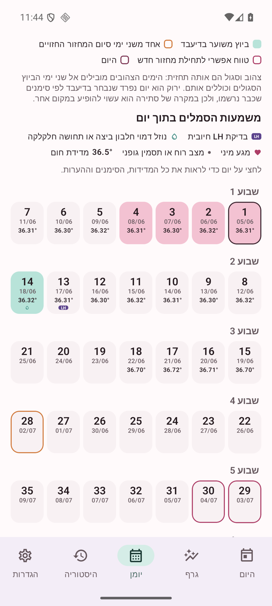
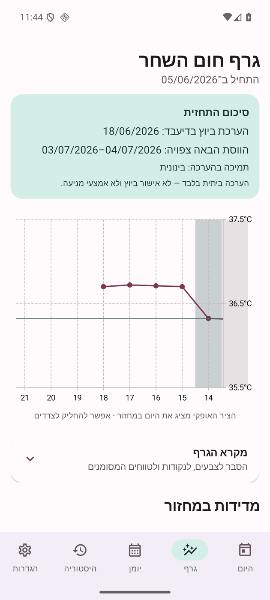
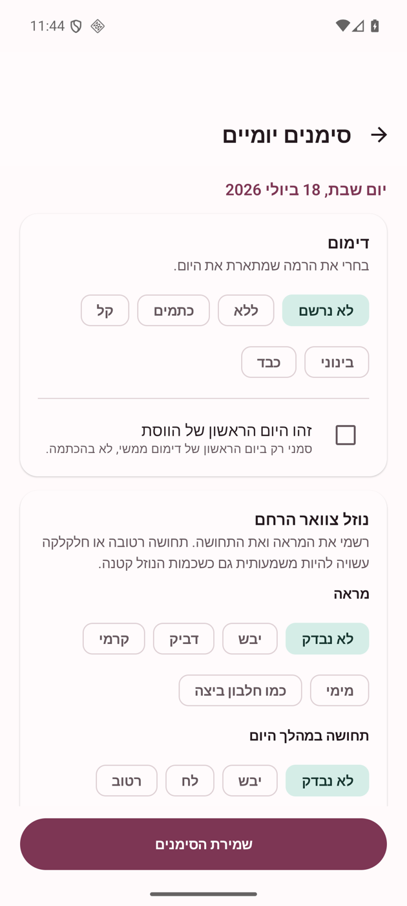

<p align="center">
  
</p>

<h1 align="center">טובתי</h1>

<p align="center">
  <strong>מעקב פוריות, בשבילך.</strong><br>
  מקום שקט, נעים ופרטי להקשיב לגוף שלך — בקצב שלך.
</p>

<p align="center">
  <sub>חינמית · ללא מטרות רווח · ללא פרסומות · ללא חשבון · Android 8 ומעלה</sub>
</p>

<p align="center">
  <a href="https://github.com/hrsi56/Tovati/releases/download/v1.5.0/Tovati-1.5.0.apk">
    
  </a>
</p>

<p align="center">
  <a href="https://hrsi56.github.io/Tovati/">לאתר של טובתי</a>
  ·
  <a href="docs/PRIVACY_HE.md">לפרטיות ואבטחה</a>
  ·
  <a href="docs/RELEASE_REPORT_1.5.0_HE.md">לדו״ח הגרסה</a>
</p>

---

## הגוף שלך מספר סיפור. טובתי עוזרת לך לראות אותו.

טובתי היא אפליקציית Android עצמאית למעקב אחר המחזור והפוריות. את רושמת במהירות את מה שידוע לך היום — חום השחר, דימום, נוזל צוואר הרחם, בדיקת ביוץ ביתית, מצב רוח, תחושות ועוד — וטובתי מסדרת את המידע ביומן מחזור ברור, בגרף נעים ובתובנות מועילות.

בלי חשבון. בלי ענן. בלי מי שמציצה מעבר לכתף.

היא נבנתה באהבה וללא מטרות רווח, כדי לתת לך כלי שמשרת אותך — לא עסק שמתפרנס מהמידע שלך.

<br>

<table>
  <tr>
    <td align="center"><strong>אין גישה לאינטרנט</strong><br><sub>האפליקציה לא יכולה לשלוח את הנתונים שלך החוצה</sub></td>
    <td align="center"><strong>אין Bluetooth או מיקום</strong><br><sub>רק ההרשאות שנחוצות לתזכורת ולנעילה</sub></td>
  </tr>
  <tr>
    <td align="center"><strong>אין פרסומות או מעקב</strong><br><sub>אין Analytics, אין חשבון ואין פרופיל שיווקי</sub></td>
    <td align="center"><strong>המידע נשאר שלך</strong><br><sub>נשמר מקומית במכשיר ומנוהל רק על ידך</sub></td>
  </tr>
</table>

## יומן שמדבר בשפה של הגוף שלך

לא עוד לוח שנה לועזי עמוס. היומן של טובתי מתקדם לפי **ימי המחזור**: יום 1, יום 2, יום 3 — בדיוק בדרך שבה הגיוני לעקוב.

כל יום מרכז עבורך את מה שנרשם בפועל ואת האומדן של האפליקציה. לחיצה על יום פותחת את כל מה שידוע עליו: מדידות, סימני פוריות, תחושות והערות. הצבעים והסמלים מוסברים בתוך האפליקציה, כך שלא צריך לנחש למה היא מתכוונת.

<p align="center">
  
</p>

## לראות את התמונה, לא רק את המספרים

גרף חום השחר מחבר בין המדידות שלך ומציג את המגמה לאורך המחזור. לידו תמצאי סיכום פשוט של מה שטובתי מעריכה כרגע, מה כבר נרשם בפועל ועד כמה הנתונים תומכים בהערכה.

התחזית מתעדכנת יחד איתך, ככל שאת מכירה את הגוף שלך ומוסיפה מידע.

<p align="center">
  
</p>

## כמה רגעים ביום, וכל המידע במקום אחד

מסכי הרישום בנויים לבחירה מהירה ונוחה. אפשר להוסיף מדידת חום, סימנים יומיים והערות בלי טבלאות מסורבלות ובלי שאלון אינסופי. גם אם החסרת יום או מדידה — טובתי שומרת על ההבדל בין „לא נרשם” לבין „לא היה”.

<p align="center">
  
</p>

## המידע הכי אישי שלך נשאר אישי

טובתי **אינה מבקשת הרשאת אינטרנט**. היא גם אינה מבקשת Bluetooth, מיקום או גישה רחבה לקבצים. אין בה פרסומות, כלי מדידה שיווקיים, שירות ענן או איסוף נתונים.

המידע שאת מזינה נשמר בתוך המרחב הפרטי של האפליקציה במכשיר שלך, תחת ההגנות של המכשיר. אפשר להפעיל נעילה ביומטרית או בקוד המכשיר ולחסום צילומי מסך — לפי בחירתך.

וכשתרצי לעבור לטלפון חדש? צרי גיבוי מוצפן בסיסמה ושלחי אותו לעצמך. במכשיר החדש בחרי את הקובץ מתיקיית „הורדות”, הזיני את הסיסמה — והמחזורים, המדידות והיומן שלך יחזרו אלייך. הסיסמה אינה נשמרת ואינה נשלחת יחד עם הגיבוי.

> הנתונים שלך הם לא המוצר. הם שלך, נשארים אצלך ונועדו רק לטובתך.

## מה מחכה לך בטובתי

- מסך „היום” שמרכז את מה שכדאי לדעת ולרשום עכשיו.
- יומן פוריות מלא לפי ימי המחזור, עם כל הפרטים בלחיצה.
- גרף חום שחר ברור ומגמות שקל להבין.
- רישום מהיר של מדידות וסימנים יומיים.
- תחזית ממוקדת ותובנות מועילות שמתעדכנות לפי הנתונים שלך.
- היסטוריית מחזורים נגישה.
- ייצוא נתונים וגיבוי מוצפן בסיסמה.
- שליחת הגיבוי למייל והעברה נוחה למכשיר חדש.
- תזכורת מקומית, נעילה וחסימת צילומי מסך — כולן אופציונליות.
- ממשק עברי מלא, נעים ומותאם לימין־לשמאל.

## מתחילות?

1. הורידי את קובץ ה־APK.
2. פתחי אותו במכשיר Android ואשרי התקנה מהמקור שבחרת, אם תתבקשי.
3. פתחי את טובתי והתחילי במחזור הנוכחי שלך.

<p align="center">
  <a href="https://github.com/hrsi56/Tovati/releases/download/v1.5.0/Tovati-1.5.0.apk">
    
  </a>
</p>

<p align="center">
  <sub>גרסה 1.5.0 · קובץ חתום · כ־3.1 MB</sub>
</p>

## הערה חשובה, כי מגיע לך מידע ישר

טובתי היא כלי ביתי למודעות לפוריות. היא אינה מוצר רפואי, אינה מאשרת ביוץ בוודאות, אינה אמצעי מניעה ואינה מחליפה ייעוץ רפואי. הגוף האנושי משתנה, וגם תחזית טובה יכולה לטעות.

<details>
  <summary><strong>מידע טכני למפתחות ולמפתחים</strong></summary>

  <br>

  האפליקציה נכתבה ב־Kotlin וב־Jetpack Compose, שומרת נתונים ב־Room, משתמשת ב־DataStore להגדרות וב־WorkManager לתזכורת מקומית. גרסת ה־release נבנית מול Android API 36 ותומכת ב־Android 8 ומעלה.

  ```bash
  ./gradlew --no-daemon testDebugUnitTest lintDebug assembleDebug
  ./gradlew --no-daemon connectedDebugAndroidTest
  ```

  מסמכים נוספים:

  - [ארכיטקטורה](docs/ARCHITECTURE_HE.md)
  - [אלגוריתם BBT ותחזית](docs/ALGORITHM_HE.md)
  - [פרטיות ואבטחה](docs/PRIVACY_HE.md)
  - [דו״ח גרסה 1.5.0](docs/RELEASE_REPORT_1.5.0_HE.md)
  - [רשימת בדיקות release](docs/RELEASE_CHECKLIST_HE.md)
</details>

---

<p align="center">
  
  <br>
  <strong>טובתי — מעקב פוריות, בשבילך.</strong>
  <br>
  <sub>נבנתה ללא מטרות רווח, באהבה לפרטיות שלך.</sub>
</p>
