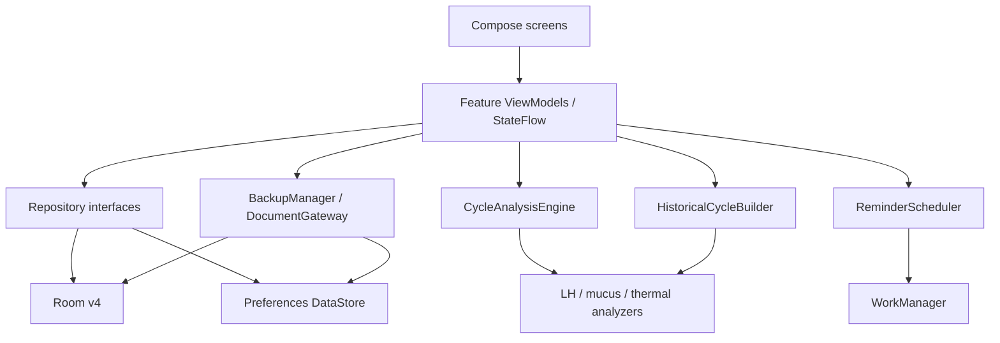

# ארכיטקטורת האפליקציה — גרסה 1.6.1

## סקירה

האפליקציה היא יישום Android יחיד (`:app`) בגישת local-first. הממשק נכתב ב־Jetpack Compose, הנתונים נשמרים מקומית ב־Room וב־DataStore, וכל ניתוח הפוריות מתבצע על המכשיר ללא שירות רשת. אין חשבון משתמש, API מרוחק, analytics או סנכרון ענן.

כל התלויות מורכבות ידנית ב־`AppContainer` שנוצר מתוך `BbtTrackerApplication`:

כיוון התלות העיקרי הוא `UI → ViewModel → domain interfaces`. מימושי האחסון תלויים ב־domain, ואילו מנוע הניתוח הוא Kotlin טהור ואינו תלוי ב־Android, Room או Compose.

## מבנה החבילות

| חבילה | אחריות |
|---|---|
| `app` | הרכבת מסך השורש, ניווט ו־`AppContainer` |
| `feature/onboarding` | קבלת הצהרת הבטיחות והגדרות ראשוניות |
| `feature/today` | איחוד נתוני היום והצגת תחזית, מקורות ההערכה ופעולה ממוקדת רק כשיש כזו |
| `feature/entry` | עריכת מדידת BBT ותצפית יומית, לרבות נוזל צוואר הרחם, מצב רוח, חשק, מגע, תסמינים ו־LH |
| `feature/chart` | סדרת BBT ושכבות נפרדות לחלון הפוריות, תחזית פרוספקטיבית והערכה רטרוספקטיבית |
| `feature/history` | מחזורים ורשומות היסטוריות והערכה רטרוספקטיבית לכל מחזור מלא |
| `feature/settings` | פרטיות, תזכורת, ייצוא, גיבוי ומחיקה |
| `domain/model` | מודלי ליבה, enums וקלטים ל־repository |
| `domain/engine` | prior אישי, היתוך רב־סימני, מנתחי LH/נוזל/BBT וניתוח היסטורי |
| `domain/insights` | זיהוי דפוסים תיאוריים עם ספי דגימה; אינו מזין את מנוע חיזוי הפוריות |
| `domain/validation` | נרמול ואימות טמפרטורה |
| `domain/repository` | חוזי הגישה לנתונים ולהגדרות |
| `data/local` | Room entities, DAOs, converters, schemas ו־migration |
| `data/repository` | מימושי repositories ועסקאות עקביות |
| `data/settings` | Preferences DataStore |
| `data/backup` | CSV, סכמת גיבוי, הצפנה ו־Storage Access Framework |
| `notification` | תזמון וביצוע תזכורת בוקר מקומית |

## מחזור חיים וזרימת מצב

`MainActivity` מארחת Compose ומאזינה להגדרות האבטחה. `AppGraph` מציג תחילה נעילה, טעינה או onboarding, ולאחר מכן את ניווט האפליקציה. מסכי עריכת מדידה ותצפית משתמשים באותו back stack של Navigation 3.

כל feature מחזיק `ViewModel` שמפרסם `StateFlow` של מצב UI. המסכים שולחים אירועים מפורשים ל־ViewModel, וה־ViewModel מפעיל repository או שירות domain. Flows של Room ו־DataStore מחזירים שינויים לממשק; Composable אינו ניגש ישירות ל־DAO.

מסכי היום, הגרף וההיסטוריה מריצים ניתוח מחדש בכל emission רלוונטי. `HistoricalCycleBuilder` הוא מקור האמת להמרת מחזורים מלאים ל־`CycleWithAnalysis`; כך שלושת המסכים אינם ממציאים בנפרד כלל היסטורי שונה.

## אחסון מקומי ו־Room v4

מסד Room נקרא `bbt-tracker.db`, גרסתו הנוכחית 4, וה־schemas המיוצאים של v1–v4 נמצאים ב־`app/schemas`. אין `fallbackToDestructiveMigration`.

| טבלה | תוכן וכללי עקביות |
|---|---|
| `cycles` | התחלה ייחודית, סוף אופציונלי, הערה ו־`analysisSite` אופציונלי וקבוע למחזור; repository מונע חפיפה וסוגר את המחזור הקודם בעסקה |
| `temperature_measurements` | זמן, timezone, טמפרטורה ב־centi-°C, אתר, שינה, הפרעות ובחירת מדידה לניתוח |
| `daily_observations` | רשומה ייחודית ליום עבור דימום, מרקם ותחושת נוזל צוואר הרחם, סימון תצפית שקשה לפרש, תוצאת LH ומטא־נתונים אופציונליים, כאב, מצב רוח והערה, חשק/אוננות, מגע מיני ומי יזמה, תסמינים, כדורים להקלה והתחלת מחזור |
| `prediction_snapshots` | מבנה קיים לתוצאות מנוע עם גרסה; התוצאות מחושבות ריאקטיבית ואינן נכתבות אליו בשימוש הרגיל |

בחירת מדידה אחת לניתוח בכל יום מתבצעת בעסקת Room: הבחירה הקודמת מתאפסת והחדשה מסומנת. ניתן לשמור כמה מדידות באותו יום, אך רק אחת נבחרת לניתוח.

Preferences DataStore מחזיק בין היתר onboarding, מטרת מעקב, אתר מדידה ברירת מחדל, תזכורת, נעילה, חסימת צילומי מסך, גרסת הצהרת הבטיחות, מועד גיבוי אחרון וטווח גרף.

### migration מ־v1 ל־v2

`MIGRATION_1_2` הוא migration מפורש ולא הרסני:

1. מוסיף ל־`cycles` את `analysisSite` כעמודה nullable.
2. משלים אותה, כאשר ניתן, מאתר המדידה הנבחרת הראשונה בתוך טווח המחזור, בסדר דטרמיניסטי לפי יום, זמן מדידה, זמן יצירה ומזהה.
3. מוסיף ל־`daily_observations` את `mucusSensation` עם ברירת המחדל `NOT_CHECKED` ואת `mucusObscured` עם ברירת המחדל `false`.
4. מוסיף את `lhTestMinutesOfDay`, `lhTestBrand` ו־`lhTestSensitivityMilliIu` כעמודות nullable.

`AppDatabaseMigrationTest` מוודא ששרשרת v1→v4 שומרת את הנתונים, משלימה אתר ניתוח ידוע ומחילה ברירות מחדל שמרניות. יש להריץ את בדיקת ה־instrumentation על debug test artifact שנבנה מאותו מקור שממנו נבנה ה־release הסופי.

### migration מ־v2 ל־v3

`MIGRATION_2_3` מוסיף ל־`daily_observations` את מסכת מצב הרוח, הערת מצב רוח, רמת החשק המיני, מגע מיני ומסכת התסמינים. כל שדה מקבל ברירת מחדל שמבדילה בין ״לא נרשם״ לבין ערך מפורש, כך שנתונים קיימים נשמרים ללא הסקה מלאכותית.

### migration מ־v3 ל־v4

`MIGRATION_3_4` מוסיף שדות nullable עבור יוזמת המגע המיני, מספר כדורים להקלה והערת תרופה. ערך חסר נשאר ״לא נרשם״ ואינו מתפרש כ״לא״ או כאפס.

## מנוע התחום

`CycleAnalysisEngine` מקבל snapshot בלתי תלוי ב־Android הכולל מחזור נוכחי, מדידות עד תאריך הניתוח, תצפיות, מחזורים היסטוריים, אתר ניתוח קבוע ואורך מחזור אופציונלי שמסרה המשתמשת ב־onboarding. גרסתו `bbt-fusion-2.3.1`.

רכיבי המנוע המרכזיים:

- `HistoricalCycleBuilder` מנתח מחזורים מלאים ומפיק יום/טווח ביוץ משוער, אותות ומהימנות עבור ה־prior האישי.
- `PersonalPriorCalculator` בונה prior רחב. הערכת אורך המחזור מה־onboarding משמשת לפני שיש היסטוריה, דועכת לצד המחזור הראשון והשני ונעלמת מהחישוב משלושה מחזורים מלאים.
- `LhSignalAnalyzer` מקבץ חיוביים לאפיזודות המעוגנות בחיובי הראשון ומבדיל תוצאה גבולית. האות הרגיל פעיל עד `+2`; חיובי נמשך מאוחר יותר באותה אפיזודה שומר את העוגן ומרחיב בזהירות את הטווח הפרוספקטיבי עד יום החיובי העדכני ועוד יום.
- `MucusSignalAnalyzer` משלב מרקם ותחושה, מתעלם מתצפית שסומנה מוסתרת ומזהה עלייה ושיא שהושלם.
- שכבת ה־repository שומרת ונועלת את `analysisSite` במחזור; `ThermalShiftDetector` משתמש באתר הקבוע, מחריג מדידות שאינן אמינות לאישור, סורק את כל המועמדים ובודק התמדה או הפרכה של דפוס.
- `CycleAnalysisEngine` מאחד את האותות, מרחיב תוצאה בסתירה ומחזיר בנפרד טווח ביוץ פרוספקטיבי, חלון פוריות וטווח רטרוספקטיבי.

המשקלים היומיים הם relative weights דטרמיניסטיים ולא הסתברויות רפואיות. רמת `ForecastReliability` היא דירוג תמיכה פנימי, לא טענת sensitivity/specificity. פירוט הכללים הממומשים נמצא ב־[ALGORITHM_HE.md](ALGORITHM_HE.md).

[FORECAST_MODEL_HE.md](FORECAST_MODEL_HE.md) הוא מסמך יעד: חלק מעקרונות ההיתוך, הפרדת הפלטים ואיסוף המטא־נתונים יושמו, אך כיול קליני ומודל הסתברותי שעבר ולידציה קלינית אינם ממומשים בגרסה זו.

## גיבוי schema v5, שחזור סכמות קודמות ו־CSV

הגישה לקבצים משתמשת ב־Storage Access Framework באמצעות `CreateDocument` ו־`OpenDocument`, ולכן אינה דורשת הרשאת אחסון רחבה.

- גיבוי חדש נוצר כ־`BackupPayload` schema v5 עם `appVersion` שנלקח אוטומטית מגרסת הבנייה הנוכחית, כולל מחזורים, מדידות, תצפיות והגדרות — ובהן אורכי המחזור והווסת שנמסרו ב־onboarding — ואז מוצפן לפני כתיבה למסמך.
- JSON מקודד עם ברירות מחדל ו־null מפורשים; מפתחות לא מוכרים אינם מתקבלים בשקט.
- השחזור תומך בסכמות 1–5. בשחזור סכמות ישנות שדות חדשים מקבלים את ברירות המחדל של המודל, ו־`analysisSite` מושלם מהמדידה הנבחרת הראשונה במחזור כאשר אפשר.
- לפני שינוי נתונים מתבצעים פענוח, אימות גרסת schema ובדיקות עקביות, לרבות שעה, אורך מותג ורגישות LH. החלפת נתוני Room מתבצעת בעסקה; snapshot מקומי בזיכרון מאפשר שחזור אם עדכון DataStore נכשל לאחר commit.
- `prediction_snapshots` אינם מגובים משום שהם נתונים נגזרים, ונעילה ביומטרית אינה משוחזרת.
- CSV הוא UTF-8 עם BOM ובכללי RFC 4180. הוא כולל שורה לכל מדידת טמפרטורה וגם שורה ליום שיש בו תצפית בלבד, וכן מצב רוח והערה, חשק מיני, מגע ומי יזמה, תסמינים, כדורים להקלה והערת תרופה, לצד נתוני נוזל צוואר הרחם, LH, כאב והערות.
- לאחר יצירת גיבוי נשמר עותק מוצפן נוסף בתיקייה הפרטית של האפליקציה. `FileProvider` מעניק לאפליקציית השיתוף הרשאת קריאה זמנית בלבד; הסיסמה אינה נשמרת ואינה מצורפת. אם תאריך יצירת מעטפת הגיבוי אינו היום, הממשק מציע ליצור גיבוי חדש לפני השיתוף.

`BackupPayloadCompatibilityTest` מכסה פענוח payload v1 והשלמת `analysisSite`; `BackupManagerInstrumentedTest` מכסה round-trip מוצפן של schema v5, כולל הגדרות ה־onboarding, וכל עמודות CSV; `ShareableBackupInstrumentedTest` מכסה את קובץ השיתוף המוצפן ואת ה־content URI.

## תזכורות ואבטחת מסך

`ReminderScheduler` מתזמן unique one-time work עד לשעה המקומית הבאה. לאחר כל הרצה ה־worker מתזמן מחדש ומחשב את ההשהיה לפי אזור הזמן ו־DST הנוכחיים, במקום להסתמך על מחזור קבוע של 24 שעות. לפני התראה הוא בודק שהאפשרות עדיין מופעלת ושאין מדידה היום. WorkManager אינו מבטיח דיוק של שעון מעורר, וב־OxygenOS יש לבדוק גם מגבלות סוללה.

כאשר נעילה מופעלת, `MainActivity` מבקשת biometric חזק או קוד מכשיר לאחר יותר מ־30 שניות ברקע. חסימת צילומי מסך מפעילה `FLAG_SECURE` לפי ההגדרה.

## בנייה וגרסאות

הגרסאות מרוכזות ב־`gradle/libs.versions.toml`. גרסה 1.6.1 משתמשת ב־`versionCode=10`, נבנית עם Java 17, `compileSdk/targetSdk 36` ו־`minSdk 26`. build מסוג release מפעיל R8 וכיווץ resources, וחתימה נטענת רק מ־`keystore.properties` מקומי.

בעת שינוי schema יש להוסיף migration מפורש, לייצא schema חדש ולבדוק שדרוג מהגרסה הקודמת עם אותה חתימה. בעת שינוי כלל ניתוח יש להעלות `ENGINE_VERSION`, להוסיף בדיקות רגרסיה ולתעד אם השתנתה משמעותו של פלט קיים.
